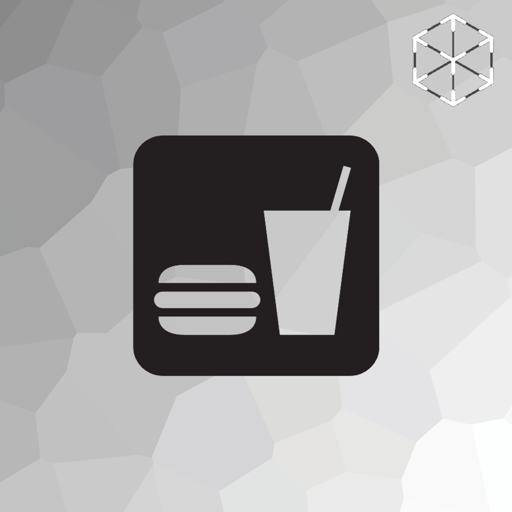

# RestARant

RestARant is an up and coming mobile app that uses Augmented Reality to change the way you see food!

Supported restaurants will place QR codes on their menu. RestARant will display them on your table before you even order
so you can see exactly what you're ordering! 

  

RestARant will also display nutritional information and ingredient lists to
help you keep a healthy lifestyle!

  

## Who Uses RestARant

* [Hack UMass VI](https://hackumass.com)

## How It Works

RestARant reads QR codes to determine the name of a specific dish from a restaurant.
It then downloads it's model from RestARant's database and then searches the USDA's database
to find nutritional value and ingredients. All of this information is then displayed to the user.

## Usage

Simply open the application and make sure the QR code you wish to read is in view. The app will automatically
read it and display the dish!

By default, the app displays the ingredients of the dish. To display nutritional information, simply tap the "Nutrition" button.

Rotate the dish by using rotating two fingers in a circular motion on the screen. Pinch the screen to make the dish bigger
or smaller!

## Developer

* [Maxwell Hubbard](https://mhubs.github.io)

## Acknowledgements

* [CGTrader](cgtrader.com) for some of the awesome example food models
* [Blender](blender.org) for confirming how bad I am at making 3D Models
* [United States Department of Agriculture](https://ndb.nal.usda.gov/ndb/search/list) (USDA) for a wonder nutritional database
* [Welch's fruit snacks](http://welchsfruitsnacks.com) for keeping me alive for 36 hours
* And of course, [Hack UMass VI](https://hackumass.com)

  

This project was created in 36 hours for Hack UMass VI

